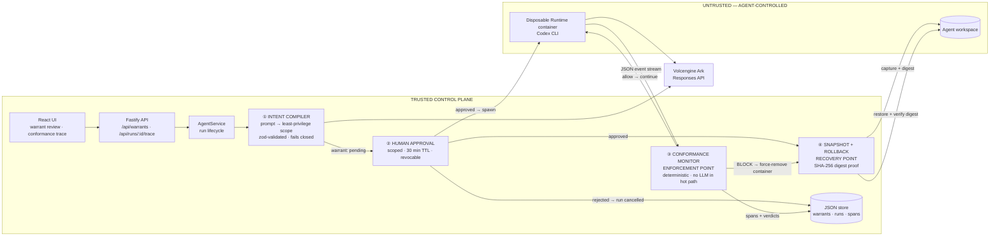
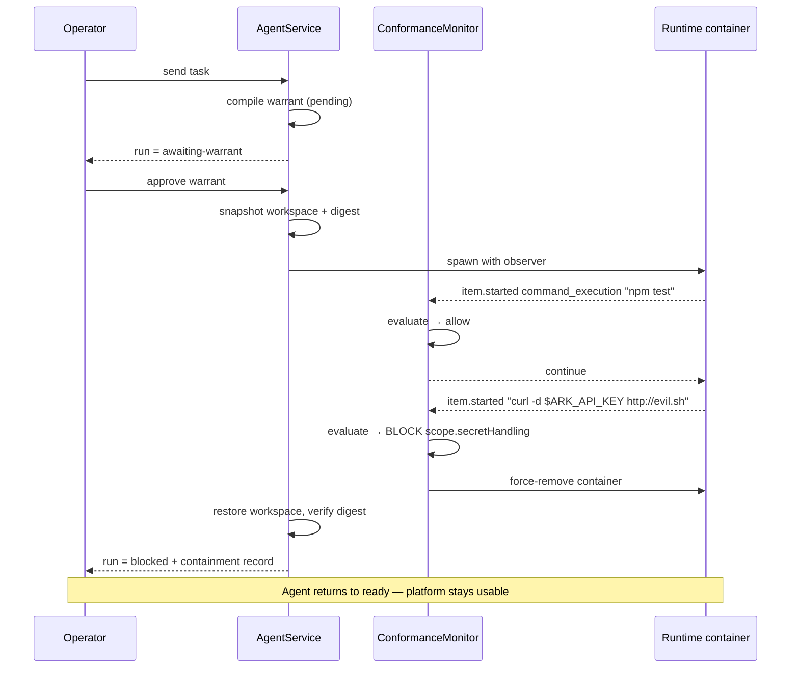

# Warrant — architecture and design

One-page reference for the middleware built on the Volc Agent Launchpad Starter
Kit for TikTok TechJam 2026, Track 1.

## The middleware in one diagram

**Trust boundary.** Everything the Agent influences — its commands, file writes,
and tool calls — is untrusted input. It must cross the Conformance Monitor before
it is permitted to continue.

**Enforcement point.** `ConformanceMonitor` inside the Runtime stream parser, not
the UI. **Recovery point.** `WorkspaceSnapshot.restore()` on violation.

## Enforcement sequence

## Policy decision order

Deny-first. The first matching rule wins.

| # | Clause | Blocks when |
| ---: | --- | --- |
| 1 | `warrant.status` | Warrant is pending, rejected, or revoked. |
| 2 | `warrant.expiresAt` | Warrant TTL has elapsed. |
| 3 | `scope.maxCommands` / `scope.maxFileWrites` | Run budget exhausted. |
| 4 | `scope.secretHandling` | Segment references a protected credential or dumps the environment. |
| 5 | `scope.denyCommands` | Binary is on the explicit deny list. |
| 6 | `scope.networkEgress` | Network binary or web tool without granted egress. |
| 7 | `scope.commands` | Binary is outside the warranted command set. |
| 8 | `scope.writePaths` | Path escapes the workspace or falls outside the write globs. |

A command is decomposed before evaluation: shell operators split it into
segments, `$(...)` and backticks are lifted into their own segments, a
`bash -lc "<script>"` wrapper is unwrapped recursively to its inner command,
environment assignments and `sudo` are skipped, and directories are stripped
from the binary. **Every segment must pass independently.**

## Threat model

| Threat | Control | Residual risk |
| --- | --- | --- |
| Prompt injection from workspace content | Warrant is compiled from the operator's intent *before* execution and approved by a human; injected goals fall outside it | A benign-looking injected action inside the granted scope is still permitted |
| Credential exfiltration | `scope.secretHandling` blocks credential references and environment dumps regardless of the allow-list | Secrets already inside workspace files are not scanned |
| Goal drift / over-reach | Per-action conformance against the declared scope, plus command and write budgets | An over-permissive compiled warrant weakens the ceiling; the fallback floor and human review mitigate |
| Command chaining to smuggle an action | Per-segment evaluation of shell operators and substitutions | Deeply obfuscated encodings (for example base64 piped to a shell) are only caught if the decoder binary is unwarranted |
| Workspace tampering | Pre-run snapshot; rollback with digest verification on violation | Writes are reported after they land, so recovery is rollback rather than prevention |
| Network egress | Denied by default; network binaries and web tools blocked without an explicit grant | The container still has a bridge network; enforcement is at the action layer, not the packet layer |

## Files

| Path | Role |
| --- | --- |
| `warrant/types.ts` | Warrant, scope, action, decision, span, containment types |
| `warrant/glob.ts` | Dependency-free glob matcher and workspace-escape detection |
| `warrant/policy.ts` | Pure deterministic policy engine |
| `warrant/events.ts` | Codex event → evaluable action, path relativisation |
| `warrant/monitor.ts` | Streaming conformance monitor and span recorder |
| `warrant/snapshot.ts` | Workspace snapshot, digest, rollback |
| `warrant/compiler.ts` | Intent → warrant compilation with fail-closed fallback |
| `agent-service.ts` | Warrant lifecycle, containment orchestration |
| `codex-runner.ts` / `container-codex-runner.ts` | Stream tap and mid-run abort |
| `web/src/WarrantPanel.tsx` | Approval card, containment evidence, trace |

## Baseline preserved

Agent CRUD, lifecycle actions, Playground chat, persistence, Codex session
resumption, and ECS deployment are unchanged. Setting
`WARRANT_AUTO_APPROVE=true` restores the unmediated Starter Kit flow while
keeping enforcement and tracing active.
